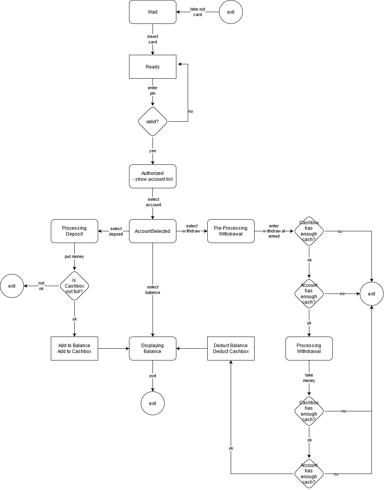

simple atm system

### How to run

```python
python -m unittest discover -p "*test.py"
```

### My Intention

Using state pattern, i try to describe the each state



about the image: I made this using draw.io. Some logics are not included since i think they are not seems important. Some logics are not exactly same in the code. for example, the decisions between PreprocessingWithdrawal and ProcessingWithdrawal are tied with the decision below the ProcessingDeposit
I used a rounded square to describe the state compared to normal behavior (called stage)

- I provide methods with same name but with different functionality

    for example back method is doing different jobs

    ```python
    At `AtmProcessingWithdrawal`
    back method do two jobs
    (1) set amount_to_withdrawn 0, 
    (2) go back to AtmPreProcessingWithdrawal state

    At `AtmAuthorized`
    back method cannot be used
    ```

I add all shared property into context variable and encapsulate it

- encapsulated `context`

    ```python
    class Atm:
        def __init__(self, bank_system=None):
            """
            Args:
                bank_system (IBankSystem):
            """
            self.__context = AtmContext()  # type: AtmContext
            self.__context.bank_system = bank_system() if bank_system else MockBankSystem1()
    ...
    ```

- `context` contains multiple states

    ```python
    class AtmContext:
        def __init__(self):
            self.states = {
                AtmWait.get_name(): AtmWait(self),
                AtmReady.get_name(): AtmReady(self),
                AtmAuthorized.get_name(): AtmAuthorized(self),
                AtmAccountSelected.get_name(): AtmAccountSelected(self),
                AtmProcessingDeposit.get_name(): AtmProcessingDeposit(self),
                AtmPreProcessingWithdrawal.get_name(): AtmPreProcessingWithdrawal(self),
                AtmProcessingWithdrawal.get_name(): AtmProcessingWithdrawal(self),
                AtmDisplayingBalance.get_name(): AtmDisplayingBalance(self),
                AtmExit.get_name(): AtmExit(self),
            }
            # Initialize first time only
            self.cash_box = None # type: CashBox
            self.bank_system = None  # type: IBankSystem
            self.update_transaction_command = None # type: IUpdateTransactionCommand
            self.on_load_func = None # type: Callable[..., NoReturn]

            # Temporal variables which can be reset on user's leave
            self.current = self.states[AtmWait.get_name()]  # type: AtmState
            self.card = None  # type: Card
            self.accounts = []
            self.selected_account = None  # type: Account
            self.amount_to_withdrawn = 0  # type: int

        def clean_context(self):
            """Clean context

            * It change the current state to AtmWait
            """
            self.current = self.states[AtmWait.get_name()]  # type: AtmState
            self.card = None  # type: Card
            self.accounts = []
            self.selected_account = None  # type: Account
            self.amount_to_withdrawn = 0  # type: int
    ```

I used template method pattern. It can be integrated with other bank api. All need to do with atm class with is just give a new bank system to argument of Atm class constructor

```python
class IBankSystem(metaclass=ABCMeta):
    """Bank system interface for future"""

    @abstractmethod
    def validate_pin(self, card_number, pin):
        """Verify pin number using server
        Args:
            card_number (str): Card number
            pin (str): Personal identification number likes '1111' or '1111-k' or else.
        """
        pass

    @abstractmethod
    def get_accounts(self, card):
        """Retrieve all accounts connected to card"""
        pass
```

I used command pattern for transaction.

Transaction pattern is used to maintain atomicity of account and cash box.

There are many actors in the atm system including User, BankSystem, CardNetwork, Cashbox, etc. For now, I haven't been able to find them all. The command pattern helps to exchange transactional logic as more component added.

```python
class IUpdateTransactionCommand(metaclass=SingletonMeta):
    @abstractmethod
    def execute(self, bank_system, cash_box, account, offset):
        return True
```

Thank you for reading this.
